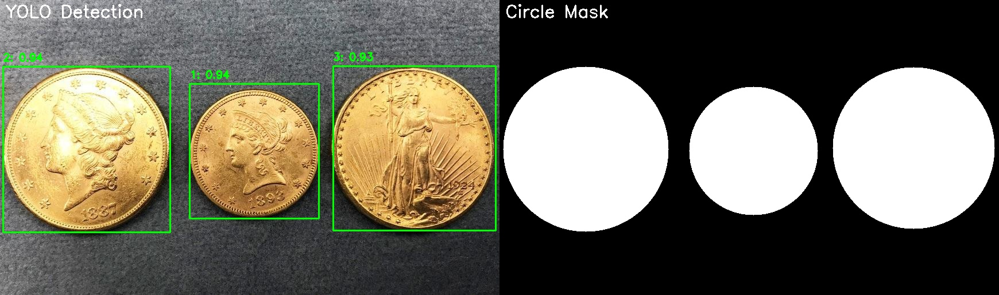

# AIQ Challenge 1 - Circular Object Detection API

Solutin to separates the circular objects in the foreground.
Display the mask and the image in the same display window


### Core Requirements
- **Image Upload**: POST endpoint to upload images with persistent storage
- **Unique Object IDs**: Each detected circular object gets a unique UUID identifier
- **Object Retrieval**: GET endpoint to retrieve all circular objects (ID and bounding box) for any image
- **Object Details**: GET endpoint to find bounding box, centroid, and radius for specific objects
- **Model Evaluation**: POST endpoint that replicates main_coin.py --test functionality
- **Python Solution**: Built with FastAPI and Python
- **Containerized**: Full Docker deployment with docker-compose

### Technical Implementation
- **Hybrid Detection**: YOLOv11 for initial detection + CV algorithms for circular object countour detection
- **Database Storage**: SQLite database with images, detections, and evaluations tables
- **Visual Output**: Combined display showing original image with detection masks
- **GPU Acceleration**: CUDA support for fast model evaluation
- **API Documentation**: Swagger UI and ReDoc documentation

### Dataset Information
- **Total Images**: 191
- **Training Images**: 152
- **Validation Images**: 39

### Performance Results
- **Precision**: 97.8%
- **Recall**: 94.2%
- **mAP@50**: 98.5%
- **mAP**: 84.9%

## Sample Output

The solution displays the mask and the image in the same display window, showing:
- Original image with detected circular objects
- Bounding boxes around each detected object
- Unique identifiers for each object
- Circular boundaries



## Quick Start

```bash
# Start the application
docker-compose up -d

# Access the API
curl http://localhost:8000/health

# View documentation
open http://localhost:8000/docs

# Access the frontend interface
open http://localhost:8080
```

## API Endpoints

- `POST /api/v1/images/upload` - Upload images
- `GET /api/v1/images/` - List all images
- `POST /api/v1/objects/detect/{image_id}` - Detect circular objects
- `GET /api/v1/objects/image/{image_id}` - Get all objects for an image
- `GET /api/v1/objects/{object_id}` - Get specific object details
- `POST /api/v1/objects/evaluate` - Run model evaluation
- `GET /api/v1/objects/visual/{image_id}` - Get visual results

## Project Structure

```
aiq-challenge-1/
├── main.py                    # FastAPI application
├── api/endpoints/             # API endpoints
├── services/                  # Business logic
├── models/                    # Database models
├── features/yolov11/          # YOLOv11 detection
├── features/cv_detection/     # CV detection algorithms
├── storage/                   # File storage
├── Dockerfile                 # Container definition
└── docker-compose.yml         # Container orchestration
```

## Access Points

- **API**: http://localhost:8000
- **API Documentation**: http://localhost:8000/docs
- **Frontend Interface**: http://localhost:8080
- **Health Check**: http://localhost:8000/health

